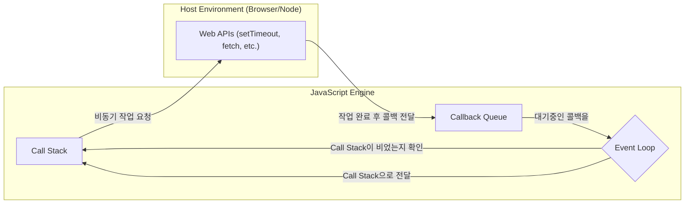

## JavaScript 동작 원리: Call Stack, Web API, Callback Queue, Event Loop

### 1. 개요

- JavaScript는 단일 스레드 기반이지만, 브라우저나 Node.js 환경(호스트 환경)과 함께 동작하며 비동기 작업을 효율적으로 처리.
- 이 과정의 핵심 요소가 바로 Call Stack, Web API, Callback Queue, Event Loop.

### 2. 핵심 구성 요소

#### 가. 콜 스택 (Call Stack)

- **개념**: JavaScript 코드 실행을 추적하는 자료구조. 함수가 호출되면 해당 함수가 스택에 쌓이고(push), 실행이 끝나면 빠져나가는(pop) 후입선출(LIFO) 방식.
- **역할**: 현재 어떤 함수가 실행 중이고, 다음에 어떤 함수가 실행될지를 제어. JavaScript는 단 하나의 콜 스택을 가지므로, 스택이 비어있지 않으면 다른 작업을 할 수 없음.

#### 나. Web API (또는 Host Environment API)

- **개념**: JavaScript 엔진 자체에는 없지만, 브라우저나 Node.js 환경에서 제공하는 API. (예: `setTimeout`, `fetch`, DOM 이벤트)
- **역할**: 시간이 오래 걸리는 비동기 작업이나 특정 이벤트를 처리. 콜 스택에서 Web API로 작업을 위임하면, JavaScript는 다른 코드를 계속 실행할 수 있어 블로킹을 방지.

#### 다. 콜백 큐 (Callback Queue / Task Queue)

- **개념**: Web API에서 처리된 비동기 작업의 콜백 함수가 대기하는 공간. 선입선출(FIFO) 방식의 큐.
- **역할**: `setTimeout`의 시간이 다 되거나, `fetch` 요청이 완료되는 등 Web API에서의 작업이 끝나면 해당 콜백 함수가 이곳으로 이동하여 실행을 기다림.
- **참고**: Promise의 `.then`/`.catch`나 `async/await`의 콜백은 '마이크로태스크 큐(Microtask Queue)'라는 별도의 큐에 들어감. 마이크로태스크 큐는 콜백 큐보다 우선순위가 높음.

#### 라. 이벤트 루프 (Event Loop)

- **개념**: 콜 스택과 콜백 큐를 지속적으로 감시하는 역할.
- **역할**:
    1. 콜 스택이 비어 있는지 확인.
    2. 콜 스택이 비어 있다면, 콜백 큐에 대기 중인 작업(콜백 함수)이 있는지 확인.
    3. 콜백 큐에 작업이 있다면, 가장 오래된 작업을 콜 스택으로 이동시켜(push) 실행.
    - 이 과정을 끊임없이 반복하며 JavaScript의 동시성을 지원.

### 3. 동작 과정 예시


```javascript
console.log('Start'); // 1

setTimeout(() => {
  console.log('Callback!'); // 4
}, 1000);

console.log('End'); // 2
```

1.  `console.log('Start')`가 콜 스택에 추가(push)되고 실행된 후 제거(pop)됨. (출력: "Start")
2.  `setTimeout` 함수가 콜 스택에 추가됨. `setTimeout`은 Web API이므로, 타이머 설정(1초)과 콜백 함수를 Web API로 위임하고 콜 스택에서 바로 제거됨.
3.  `console.log('End')`가 콜 스택에 추가되고 실행된 후 제거됨. (출력: "End")
4.  (1초 후) Web API에서 타이머가 완료되면, `setTimeout`의 콜백 함수 `() => { console.log('Callback!'); }`를 콜백 큐로 보냄.
5.  이벤트 루프는 콜 스택이 비어있는 것을 확인하고, 콜백 큐에 있던 콜백 함수를 콜 스택으로 이동시킴.
6.  콜 스택으로 이동한 콜백 함수가 실행됨. (출력: "Callback!")

### 4. 시각적 표현 (Diagram)


